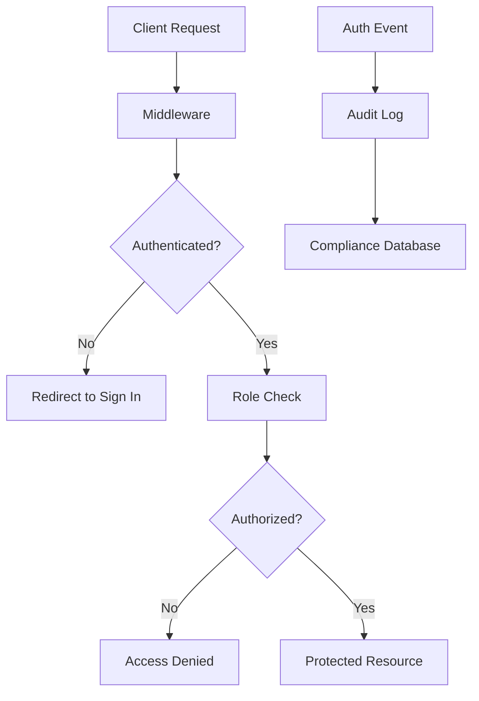
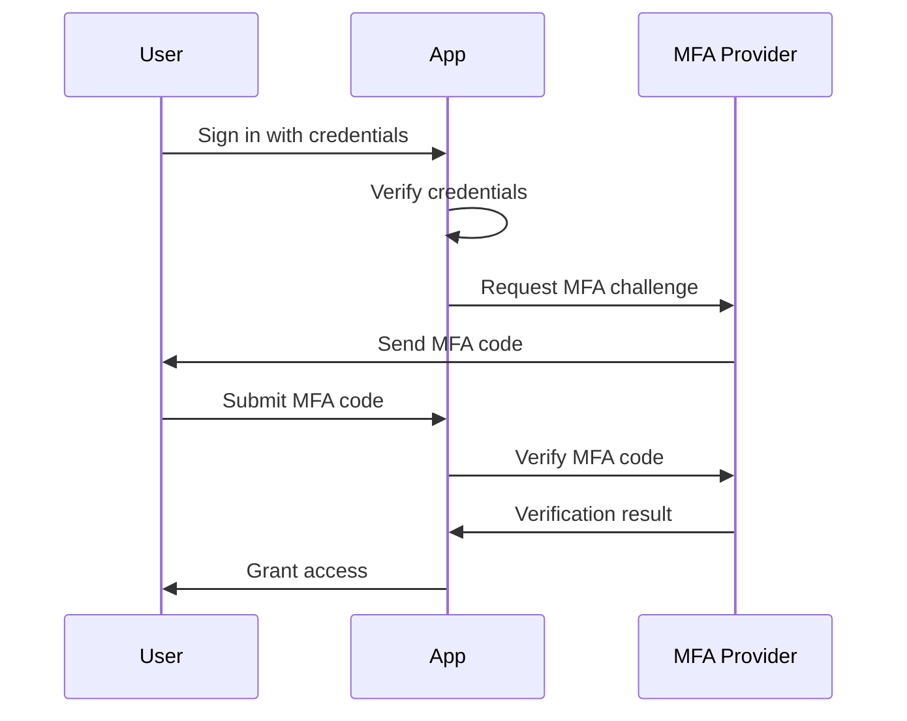

# Authentication Security Guide

## Security Architecture



## Session Management

### JWT Strategy

- **Algorithm**: HS256 with secure secret
- **Expiry**: 15 minutes for enhanced security
- **Refresh**: Automatic token refresh
- **Storage**: HTTP-only secure cookies
- **Encryption**: All session data encrypted

### Session Configuration

```typescript
session: {
  strategy: "jwt",
  maxAge: 15 * 60, // 15 minutes
},
jwt: {
  maxAge: 15 * 60, // 15 minutes
}
```

### Security Headers

Applied via middleware to all requests:

```typescript
// Security headers for compliance
response.headers.set("X-Frame-Options", "DENY")
response.headers.set("X-Content-Type-Options", "nosniff")
response.headers.set("Referrer-Policy", "strict-origin-when-cross-origin")
response.headers.set("X-XSS-Protection", "1; mode=block")
response.headers.set(
  "Strict-Transport-Security",
  "max-age=31536000; includeSubDomains"
)
response.headers.set(
  "Content-Security-Policy",
  "default-src 'self'; script-src 'self' 'unsafe-eval' 'unsafe-inline' https://js.stripe.com"
)
```

## Role-Based Access Control (RBAC)

### User Roles

```typescript
enum UserRole {
  USER        // Basic free tier access
  PROFESSIONAL // Professional tier features  
  ENTERPRISE  // Multi-client enterprise features
  ADMIN       // Administrative access
}
```

### Permission Matrix

| Feature | USER | PROFESSIONAL | ENTERPRISE | ADMIN |
|---------|------|--------------|------------|-------|
| Basic Calculator | ✅ | ✅ | ✅ | ✅ |
| Document Generation | ❌ | ✅ | ✅ | ✅ |
| Multi-Client Access | ❌ | ❌ | ✅ | ✅ |
| White-label Features | ❌ | ❌ | ✅ | ✅ |
| Admin Dashboard | ❌ | ❌ | ❌ | ✅ |
| User Management | ❌ | ❌ | ❌ | ✅ |

### Role Enforcement

```typescript
// Page-level protection
<AuthGuard requiredRole={UserRole.PROFESSIONAL}>
  <ProfessionalFeatures />
</AuthGuard>

// Component-level protection
const { isProfessional } = useAuth()
{isProfessional && <PremiumFeature />}
```

## Data Protection

### Field-Level Encryption

Sensitive fields are encrypted in the database:

```typescript
// Encrypted fields in models
description: String      // Encrypted
currentValue: Float      // Encrypted  
notes: String?          // Encrypted
filePath: String        // Encrypted file path
ipAddress: String?      // Encrypted
userAgent: String?      // Encrypted
```

### Encryption Implementation

```typescript
import { encrypt, decrypt } from "@/lib/encryption"

// Encrypt before saving
const encryptedValue = encrypt(sensitiveData)

// Decrypt when reading
const decryptedValue = decrypt(encryptedValue)
```

## Audit Logging

### Compliance Requirements

All authentication events are logged for:
- **SOC 2 Type II** compliance
- **GDPR/CCPA** data protection regulations
- **Legal technology** audit requirements

### Logged Events

```typescript
enum AuditAction {
  SIGN_IN           // User authentication
  SIGN_OUT          // User logout
  ACCOUNT_CREATED   // New account registration
  PASSWORD_CHANGED  // Password updates
  MFA_ENABLED       // Multi-factor auth enabled
  MFA_DISABLED      // Multi-factor auth disabled
  CREATE            // Resource creation
  READ              // Resource access
  UPDATE            // Resource modification
  DELETE            // Resource deletion
  CALCULATE         // Property calculations
  GENERATE_DOCUMENT // Document generation
  EXPORT            // Data export
}
```

### Compliance Levels

```typescript
enum ComplianceLevel {
  STANDARD   // Basic user operations
  FINANCIAL  // Payment-related operations
  LEGAL      // Document generation and legal operations
}
```

### Audit Log Structure

```typescript
interface AuditLog {
  id: string
  userId: string
  action: AuditAction
  resource: string           // Table name or resource identifier
  resourceId?: string        // ID of affected resource
  details?: string          // Encrypted JSON with action details
  ipAddress?: string        // Encrypted IP address
  userAgent?: string        // Encrypted user agent
  complianceLevel: ComplianceLevel
  createdAt: DateTime
}
```

## OAuth Security

### Provider Configuration

#### Google OAuth
- **Scope**: `openid email profile`
- **Verification**: Email auto-verified
- **Security**: PKCE flow enabled

#### Apple OAuth
- **Scope**: `name email`
- **Verification**: Email auto-verified
- **Security**: Private key authentication

#### Microsoft OAuth
- **Scope**: `openid email profile`
- **Verification**: Email auto-verified
- **Security**: Azure AD integration

### OAuth Security Best Practices

1. **State Parameter** - CSRF protection enabled
2. **PKCE Flow** - Code challenge/verifier
3. **Secure Redirect** - Validated redirect URIs
4. **Token Validation** - Signature verification
5. **Scope Limitation** - Minimal required permissions

## Multi-Factor Authentication (MFA)

### Future Implementation

The system is prepared for MFA with:
- `mfaEnabled` field in User model
- MFA audit events defined
- Token-based verification ready

### MFA Flow (Planned)



## Production Security Checklist

### Deployment Security

- [ ] HTTPS enforced for all routes
- [ ] Secure `NEXTAUTH_SECRET` (32+ characters)
- [ ] Environment variables secured
- [ ] Database connections encrypted (SSL/TLS)
- [ ] Rate limiting enabled on auth endpoints
- [ ] CORS properly configured
- [ ] Security headers implemented

### Monitoring & Alerts

- [ ] Authentication failure monitoring
- [ ] Suspicious activity detection
- [ ] Session anomaly detection
- [ ] Failed login attempt tracking
- [ ] Audit log monitoring
- [ ] Security incident response plan

### Compliance Requirements

- [ ] Data retention policies implemented
- [ ] Audit trail completeness verified
- [ ] GDPR/CCPA compliance validated
- [ ] SOC 2 controls documented
- [ ] Legal technology standards met
- [ ] Regular security assessments scheduled

## Security Incident Response

### Authentication Compromise

1. **Immediate Actions**
   - Revoke all active sessions
   - Reset authentication secrets
   - Enable additional monitoring
   - Notify affected users

2. **Investigation**
   - Review audit logs
   - Identify compromise scope
   - Document timeline
   - Preserve evidence

3. **Recovery**
   - Update security measures
   - Force password resets
   - Implement additional controls
   - Monitor for recurring issues

### Data Breach Response

1. **Detection & Assessment**
   - Identify breach scope
   - Assess data sensitivity
   - Evaluate legal requirements
   - Document incident details

2. **Containment**
   - Stop ongoing breach
   - Secure compromised systems
   - Preserve evidence
   - Prevent data loss

3. **Notification**
   - Legal authority notification
   - User notification (if required)
   - Stakeholder communication
   - Regulatory compliance

## Regular Security Maintenance

### Monthly Tasks
- Review access permissions
- Update security dependencies
- Analyze authentication patterns
- Test backup procedures

### Quarterly Tasks
- Security audit review
- Penetration testing
- Compliance assessment
- Incident response testing

### Annual Tasks
- Full security assessment
- Compliance certification renewal
- Security policy updates
- Disaster recovery testing

*Last updated: December 15, 2024*